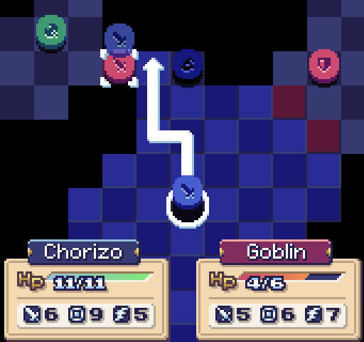

# tactics
> A tabletop-style strategy game built around fixed unit interactions, perfect information, and deterministic combat.

[Play the demo](https://semibran.github.io/tactics-new)



A small [TRPG](https://en.wikipedia.org/wiki/Tactical_role-playing_game) primarily inspired by [Fire Emblem](https://en.wikipedia.org/wiki/Tactical_role-playing_game). I've attempted to remove any and all elements that hamper strategic gameplay in favor of determinism and semi-perfect information a la chess, so no RNG-based combat or unexpected reinforcements. However, predictable AI and RPS-style unit interactions are still alive and well.

## How to play
All interactions are performed with mouse or touch inputs, depending on the client device.
- Press and hold a unit, then drop it on the square or enemy you want to move to or attack.
- Alternatively, click a unit to select it, then click on a blue or red square to move or attack.
- After clicking a unit, you can deselect it or pan around by clicking or dragging outside of the blue squares.
- When attacking at an angle, it's typically a good idea to first hold the square you want to move to, then maneuver to your target outside the blue squares. In the final product, there would be a menu supplementing a move -> attack action flow which hasn't been implemented here yet.

As a disclaimer: the stage design here is a bit unforgiving. Consider checking out [a previous iteration of this project][prototype] which is a tad lighter on the boss segment and the controls side of things, and also has slightly fancier backgrounds and VFX.

## Classes
The demo currently demonstrates six unit classes. A unit's class is indicated by its icon as "engraved" into the piece, and denotes that unit's typical capabilities at a glance.
- ⚔️ Soldier: A balanced class with good HIT and middling stats elsewhere. Weapon is SWORD.
- 🪓 Fighter: Focuses all effort into ATK at the expense of all HIT and DEF. AXE attacks ignore all armor.
- 🛡 Knight: Heavily armored, boasting high DEF and HIT, but suffers from lack of mobility. Weapon is LANCE.
- 🗡 Thief: Quick but flimsy. Able to dodge most attacks and deliver twin DAGGER attacks to slower enemies. Can also move farther than most units per turn.
- 🏹 Archer: Fast and can snipe targets from a distance with BOW attacks, but prove vulnerable at close range.
- 🧙‍♂️ Mage: Can hit from near and afar with powerful magic attacks, but may suffer from low HIT, SPD. or DEF.

## Stats
Unlike in the [prototype], each unit has its own set of stats which directly influence its performance in combat. The intent of this change is to add variety between units of the same class, make boss units more difficult to overcome, and eventually pave the way for skills that would temporarily reduce relevant stats on usage. The latter change would ideally further encourage participation of the player's entire army.

Each unit's preview window has three icons indicating its stats. More icons would be displayed in a unit's details window, but have been omitted from the smaller preview due to space constraints on smaller devices.

The three icons on each unit's preview window represent the following stats:
- ⚔️ ATK: The leftmost icon indicates the unit's equipped weapon and attack power. Most icons aim for a target's DEF stat, with the exception of ⚡️ or 💀 (Volt or Dark-elemental "weapons") which target an enemy's RES stat. Other elements listed in the source but not included in the demo map are 🔥, ❄️, 🌱, and ☀️: Fire, Ice, Plant, and Light respectively.
- 🎯 HIT: The middle icon specifies the unit's "chance" of landing an attack or a critical hit (not implemented). An unit's attack if their HIT is greater than the target's SPD, and it will always miss if their HIT is equal or lower.
- 🧚/🛡 SPD/DEF: The rightmost icon will display SPD (sorry, no wing emoji) in most cases, but may display DEF if the unit's DEF stat is greater than its SPD. A unit will always dodge if its SPD is greater than the attacker's HIT, and will attack twice if its SPD is at least 3 points higher than its target's. On the other hand, DEF is simply a modifier to directly decrease damage on a per-point basis, i.e. DMG = ATK - DEF.

RES is always hidden, but essentially has the same effect as DEF except for magical attacks. This stat would be visible in a unit details window.

## Running locally
```sh
$ git clone git@github.com:semibran/tactics-new
$ cd tactics-new
$ pnpm i
$ make dev
$ pnpx serve dist
```

## License
[MIT](https://opensource.org/licenses/MIT) © [Brandon Semilla](https://git.io/semibran)

[prototype]: https://github.com/semibran/tactics
